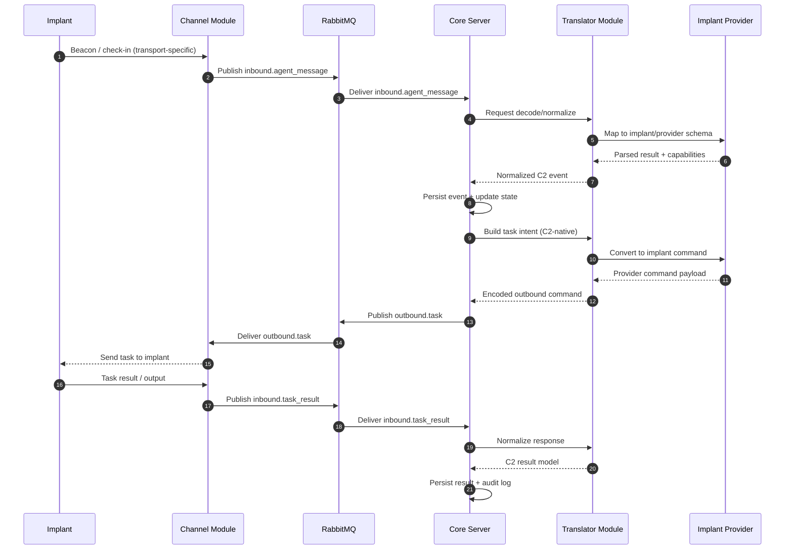
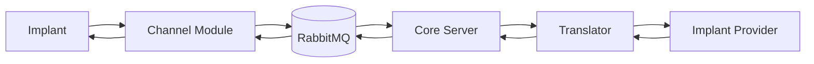

# Message Flow (Implant ↔ C2)

This diagram documents how messages move between implants and the modular C2 stack.

## End-to-End Sequence

## Responsibility Map

## Notes

- `Channel` handles transport/session delivery only.
- `Translator` handles language/model conversion only.
- `Implant Provider` handles implant family specifics (commands/build/capabilities).
- `Core Server` owns orchestration, policy, persistence, and audit.
- All inter-service traffic should carry `message_id` and `correlation_id`.
